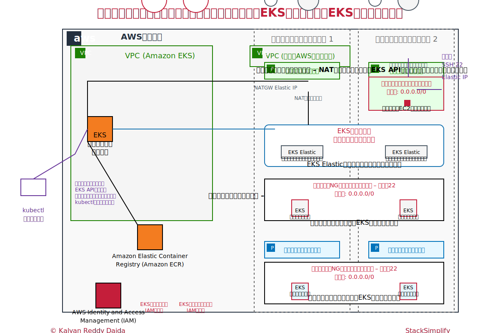

# AWS EKS Cluster Terraform Project

This repository contains Terraform configurations created for practicing how to deploy an Amazon EKS (Elastic Kubernetes Service) cluster with supporting infrastructure.

## Architecture

→ 修正中

## Components

### VPC
- Multi-AZ VPC with public and private subnets
- NAT Gateways for private subnet internet access
- Configured with proper route tables and internet gateway

### EC2 Bastion Host
- Secure SSH access point to the cluster
- Located in public subnet with Elastic IP
- Includes security groups and SSH provisioners

### EKS Cluster
- EKS Control Plane with managed configurations
- IAM roles and policies for EKS cluster and node groups
- Security groups for cluster communication
- Both public and private node groups

## File Structure

### VPC Configuration
- `c3-01-vpc-variables.tf` - VPC input variables
- `c3-02-vpc-module.tf` - AWS VPC Terraform module
- `c3-03-vpc-outputs.tf` - VPC outputs
- `vpc.auto.tfvars` - VPC variable values

### EC2 Bastion Host
- `c4-01-ec2bastion-variables.tf` - Bastion host variables
- `c4-02-ec2bastion-outputs.tf` - Bastion host outputs
- `c4-03-ec2bastion-securitygroups.tf` - Security group configuration
- `c4-04-ami-datasource.tf` - AMI data source
- `c4-05-ec2bastion-instance.tf` - EC2 instance definition
- `c4-06-ec2bastion-elasticip.tf` - Elastic IP allocation
- `c4-07-ec2bastion-provisioners.tf` - Terraform provisioners
- `ec2bastion.auto.tfvars` - Bastion host variable values

### EKS Cluster
- `c5-01-eks-variables.tf` - EKS input variables
- `c5-02-eks-outputs.tf` - EKS outputs
- `c5-03-iamrole-for-eks-cluster.tf` - IAM role for EKS cluster
- `c5-04-iamrole-for-eks-nodegroup.tf` - IAM role for node group
- `c5-05-securitygroups-eks.tf` - Security groups for EKS
- `c5-06-eks-cluster.tf` - EKS cluster definition
- `c5-07-eks-node-group-public.tf` - Public node group
- `c5-08-eks-node-group-private.tf` - Private node group
- `eks.auto.tfvars` - EKS variable values

### Core Files
- `c1-versions.tf` - Terraform and provider versions
- `c2-01-generic-variables.tf` - Generic input variables
- `c2-02-local-values.tf` - Local values
- `terraform.tfvars` - Variable values

## Prerequisites

- AWS CLI configured with appropriate credentials
- Terraform (version specified in `c1-versions.tf`)
- SSH key pair for bastion host access

## Usage

1. Clone the repository
2. Update variable values in `.auto.tfvars` files as needed
3. Initialize Terraform:
   ```bash
   terraform init
   ```
4. Review the execution plan:
   ```bash
   terraform plan
   ```
5. Apply the configuration:
   ```bash
   terraform apply
   ```
6. To access the cluster, use the bastion host with:
   ```bash
   ssh -i private-key/terraform-key.pem ec2-user@<BASTION-HOST-IP>
   ```
7. To destroy the infrastructure when no longer needed:
   ```bash
   terraform destroy
   ```

## Important Notes

- The private key directory contains sensitive information and should not be committed to Git (it's included in .gitignore)
- The `local-exec-output-files` directory contains outputs from local-exec provisioners
- Configuration is set up for both public and private node groups to demonstrate different deployment options
